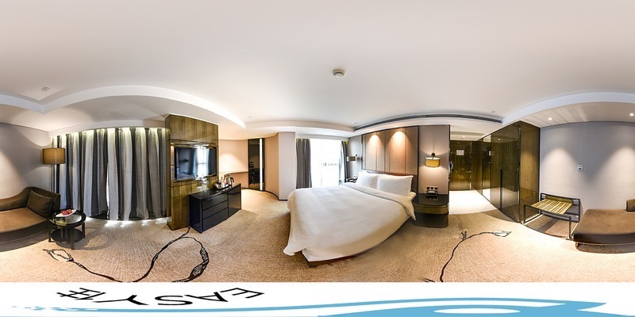

## VrPano
> 基于threejs实现的vr全景图管理系统


demo地址：

[前端展示](http://jsrun.net/gigKp/embedded/all/light/)

[录制数据](http://jsrun.net/figKp/embedded/all/light/)

## 使用方法

### 安装依赖包
```bash
 npm i vr-panorama
 yarn add vr-panorama
```

### 浏览器中使用
根据你需要的功能引入对应的sdk文件
```html
<!--只包含全景图展示功能-->
<script src="https://unpkg.com/vr-panorama@latest/dist/VrTraveller.js"></script>
<!--只包含全景图录制数据功能-->
<script src="https://unpkg.com/vr-panorama@latest/dist/VrAligner.js"></script>
<!--包含VrTraveller和VrAligner-->
<script src="https://unpkg.com/vr-panorama@latest/dist/VrPano.js"></script>
```

### 加载依赖
```js
// 如果是在浏览器中使用，不需要引入，可以直接通过window对象拿到
import VrPano from 'vr-panorama';
const { VrTraveller, VrAligner } = VrPano;

// 用来展示vr的容器
const box = document.querySelector('#container');
// 渲染vr所需要的数据
const data = getNaviData();
// 如果需要前端展示
const traveller = new VrTraveller(data, box);

// 如果需要录制数据
const aligner = new VrAligner(data, box);

```
### data格式

```js
[{
    // 场景的角度及资源
    "scene": {
      // 场景的唯一标识
      "photo_key": "1",
      // 场景的校正角度
      "correction": [0, 0, 0],
      // 场景的旋转角度 水平，数值，第三项固定为0
      "rotation": [180, 0, 0],
      "title": "卧室",
      // 球面贴图的资源
      "sphereSource": {
        //缩略图
        thumb: `${sourceRoot}/sphereSource/1/thumb.jpg`,
        // 清晰切片图
        slices: getSphereSliceUrl(1)
      },
      // 立方体贴图的资源
      "cubeSource": {
        thumb: `${sourceRoot}/cubeSource/1/thumb.jpg`,
        slices: getCubeSliceUrl(1)
      },
      // 是否默认展示该场景
      "is_main": 1
    },
    // 场景的导航
    "overlays": [{
      "title": "洗手间",
      // 导航的位置，x:经度，y:纬度
      "x": 4.6720072719141,
      "y": -0.52291666726088,
      // 导航的跳转场景标识
      "next_photo_key": "2"
    },
    {
      "title": "厨房",
      "x": 4.6720072719141,
      "y": 0.52291666726088,
      "next_photo_key": "2"
    }]
  },
  {
    "scene": {
      "photo_key": "2",
      "correction": [0, 0, 0],
      "rotation": [180, 0, 0],
      "title": "卫生间",
      "sphereSource": {
        thumb: `${sourceRoot}/sphereSource/2/thumb.jpg`,
        slices: getSphereSliceUrl(2)
      },
      "cubeSource": {
        thumb: `${sourceRoot}/cubeSource/2/thumb.jpg`,
        slices: getCubeSliceUrl(2)
      },
      "is_main": 0
    },
    "overlays": [{
      "title": "卧室",
      "x": 3.4483749837697,
      "y": -0.7169249148447,
      "next_photo_key": "1"
    }]
  }]
```

sdk会判断当前浏览器是否支持webgl，如果支持的话就使用`sphereSource`作为资源图片,否则使用`css3d`使用`cubeSource`完成全景图的渲染。

对于每一个场景，需要准备一个thumb表示缩略图，一般是一张不太清晰的全景图，用户网络不好的情况下也能看到东西，然后slices是该场景的切片图。如果是webgl渲染，这个slices是一个长度为4的数组，数组每一项长度为8;也就是将清晰的全景图切成了4行8列，然后保存到slices中。如果是css3d渲染，thumb同样是一张缩略图，slices是一个长度为6的数组，保存立方体6的面的图片地址。

针对这个项目，我写了一个项目来生成图片资源，对于球面图资源，你只需要提供一个清晰的全景图，就可以为你切出4*8=32张碎片图，对于立方体图资源，你需要提供6个面的缩略图，然后为你生成一整张缩略图。这里是[项目地址](https://github.com/fightingm/vrsources).
下面是球面缩略图和立方体缩略图的大概样子：



### VrTraveller

`VrTraveller`提供了`GlassesButton`功能，可以支持开启VR眼镜浏览模式，如果需要的话，可以这样使用：
```js
// vr眼镜，可选
const glassesButton = new VrTraveller.GlassesButton();
traveller.setGlassesButton(glassesButton);
```
注意：VR眼镜浏览功能是通过监听手机的陀螺仪来实现的，所以需要在移动端体验，某些机型可能不支持。

### VrAligner 实例方法及属性

#### walkTo(key)

- 参数：
    -{ string } key
- 功能：实现场景的跳转

#### setMainScene(key)

- 参数：
    -{ string } key
- 功能：设置指定的场景为主场景(有多个场景时,默认渲染该场景)

#### saveRotation()

- 功能：保存当前场景的角度设置

#### resetRotation()

- 功能：重置当前场景的角度为上一次保存的角度

#### getCorrection()

- 功能：获取到当前场景的校验角度

#### getRotation()

- 功能：获取到当前场景的旋转角度

#### rotateYaw(val)

- 参数：
    -{ string | number } val
- 功能：设置当前场景的`yaw`偏转角

#### rotateRoll(val)

- 参数：
    -{ string | number } val
- 功能：设置当前场景的`roll`偏转角

#### rotatePitch(val)

- 参数：
    -{ string | number } val
- 功能：设置当前场景的`pitch`偏转角

#### rotateY(val)

- 参数：
    -{ string | number } val
- 功能：设置当前场景沿着Y轴旋转角度

#### rotateX(val)

- 参数：
    -{ string | number } val
- 功能：设置当前场景沿着X轴旋转角度

#### addOverlay(title, key)

- 参数：
    -{ string } title 导航名称(唯一)
    -{ string } next_photo_key 导航的跳转场景标识
- 功能：在当前场景中添加一个导航

#### naviData

- Array
- 详细: 当前项目的配置数据

